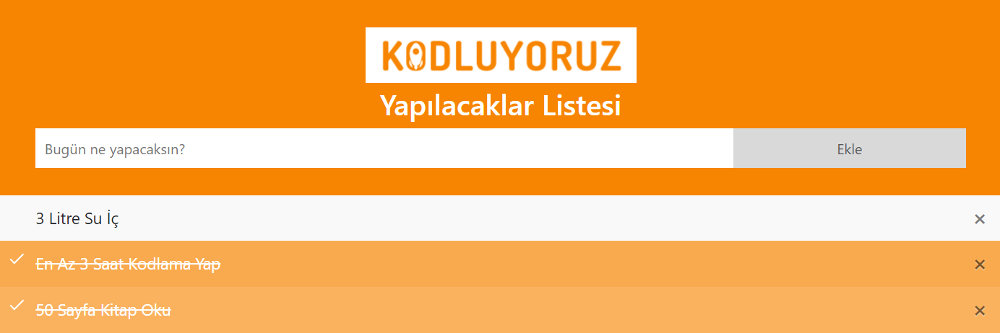

# To-Do List Project

This project is a simple web application that allows users to create and manage their daily to-do lists. Users can add, check, or delete tasks.

## Features

- Ability to add to-do tasks
- Ability to check off to-do tasks
- Ability to delete to-do tasks
- Automatic data storage in local storage
- User-friendly interface

## Installation

1. Clone this repository to your local machine.
2. Navigate to the downloaded folder.
3. Open the `index.html` file in a web browser.

## Usage

- To add a new to-do task, enter the task in the text box and click the "Add" button.
- To mark a to-do task as complete, click on it.
- To delete a to-do task, click the "X" icon next to it.

## Contributing

This project is open to any kind of contributions. Please open an issue to discuss any changes before submitting a pull request.

1. Fork this repository to your GitHub account.
2. Create a new branch: `git checkout -b my-new-feature`
3. Commit your changes: `git commit -am 'Add some feature'`
4. Push to your branch: `git push origin my-new-feature`
5. Submit a pull request.
